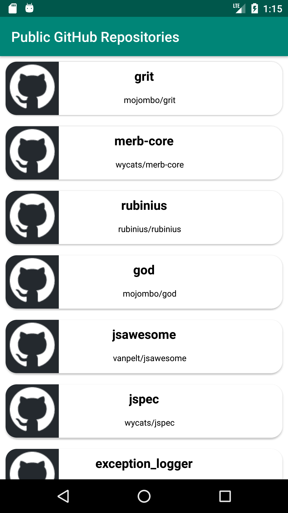
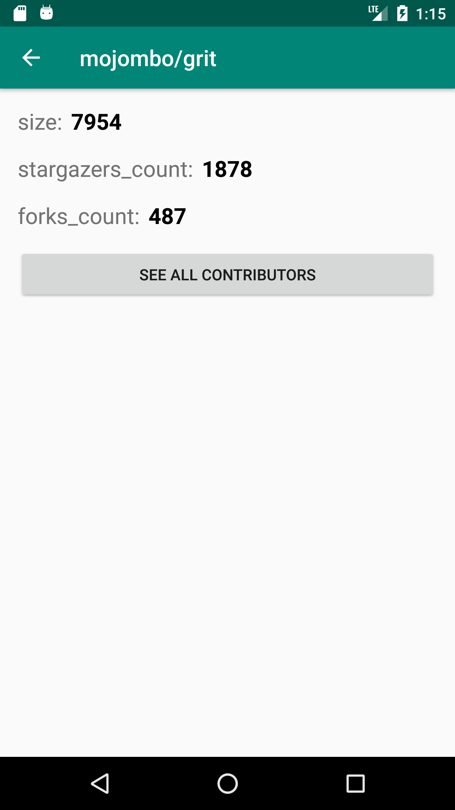
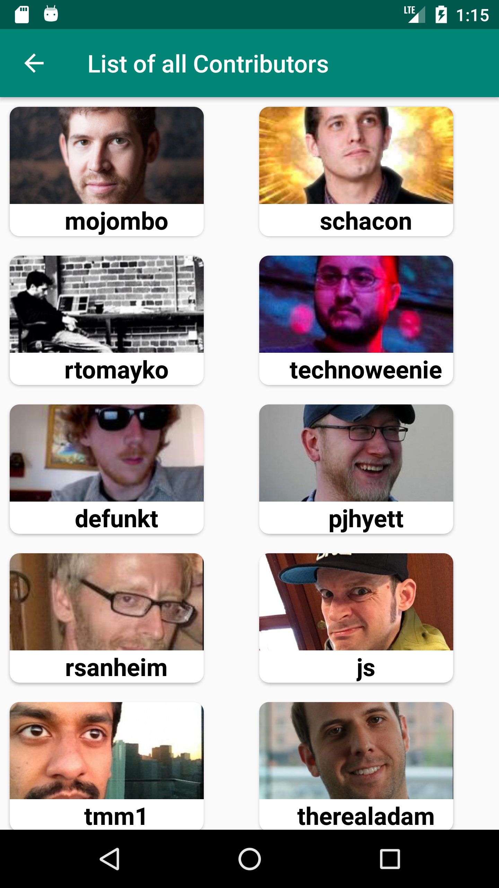

# GitHubApi
 
 

When the app has started a list of all public repositories with the login name of the owner is displayed.
 

 
 
When a repository is selected size, stargazers count, and forks count of the repository is displayed.
 

 
 
The last screen shows a list of all contributors of the repository with their login name and avatar picture.
 

